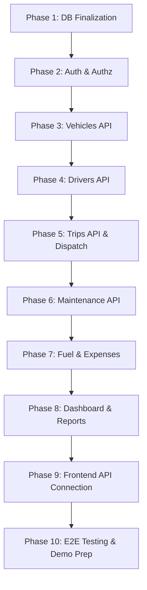

# TransitOps Development Roadmap & Project Progress

This document tracks the current implementation status, team ownership, integration state, blockers, and next development steps for TransitOps. It serves as the single source of truth for the project's progress and roadmap.

---

## 1. Current Project Status

### COMPLETED

#### 1. Repository and Collaboration Foundation
* **GitHub Repository:** Initialized and hosted.
* **Dev Integration Branch:** `dev` established as the main integration branch.
* **Workflow:** Feature-branch (`feature/*`, `fix/*`, `docs/*`, `test/*`) and pull-request workflow established.
* **Operating Instructions:** `.agents/AGENTS.md` operating instructions added.
* **Templates:** Issue and Pull Request templates added to `.github/`.

#### 2. Backend Foundation
* **Environment:** Express and TypeScript backend initialized.
* **Architecture:** Modular backend architecture created (per-module folders with separated route, controller, service, repository, and validator files).
* **Environment Validation:** Strict environment variable validation using Zod at startup.
* **Security & Utilities:** Helmet, CORS, JSON parsing, and request logging configured.
* **Error Handling:** Global centralized error handling middleware added. Reusable `AppError`, `asyncHandler`, and API response utilities added.
* **Health Check:** `GET /api/health` implemented.
* **Placeholder Routes:** Placeholder routes registered for all 10 planned modules:
  * Authentication
  * Dashboard
  * Vehicles
  * Drivers
  * Trips
  * Maintenance
  * Fuel Logs
  * Expenses
  * Reports
  * Settings
* **Testing:** Backend foundation integration tests implemented and passing.

#### 3. Database Foundation
* **Prisma & PostgreSQL:** PostgreSQL and Prisma foundation added.
* **Schema Merge:** Database schema merged into the `dev` branch.
* **Configuration:** Prisma configuration added.
* **Status:** Database integration is currently being finalized by the database owner.
* **Integrations:** Current schema and seed integration must be verified before dependent backend feature modules are finalized.

#### 4. Frontend Foundation
* **Environment:** React, TypeScript, and Vite frontend initialized.
* **Styling & UI:** Tailwind CSS and reusable UI components added (via shadcn/ui).
* **Layout:** Application layout added, featuring sidebar and top navigation.
* **Auth Screens:** Authentication (login and OTP verification) screens added.
* **Routing:** Protected routing foundation added.
* **Placeholder Pages:** Placeholder pages added for all 10 planned modules:
  * Dashboard
  * Vehicles
  * Drivers
  * Trips
  * Maintenance
  * Fuel and Expenses
  * Reports
  * Settings

---

## 2. Current Team Ownership

* **Database Owner:**
  * Finalize Prisma schema, generated client integration, seed compatibility, database validation, and database-related fixes.
* **Frontend Owner:**
  * Continue frontend page implementation, reusable components, responsive UI, loading states, empty states, error states, and API integration preparation.
* **Backend/API Owner:**
  * Begin feature APIs after the final database contract is stable.
  * *Initial Priority:* Vehicles API.

---

## 3. Next Implementation Order



### Phase 1: Database Finalization & Verification
* Finalize and verify database integration.
* Ensure Prisma schema and seed are fully compatible.
* Generate Prisma Client.
* Pass backend type-check, lint, and test suites.

### Phase 2: Authentication and Authorization
* Implement authentication endpoints (Login, Signup, Refresh, Logout).
* Implement current-user endpoint (`GET /auth/me`).
* Implement JWT authentication checks.
* Implement role and permission authorization middleware.

### Phase 3: Vehicles API
* Implement vehicle listing with pagination, search, and filtering.
* Implement vehicle details endpoint.
* Implement create and update vehicle endpoints.
* Implement vehicle status management.
* Implement input validation schemas.
* Separate implementation into controller, service, repository, and validation layers.
* Write unit/integration tests and update API documentation.

### Phase 4: Drivers API
* Implement driver listing and details endpoints.
* Implement create and update driver profiles.
* Implement driver availability and licence expiration/validity checks.
* Write unit/integration tests.

### Phase 5: Trips API (Dispatch & Scheduling)
* Implement trip creation and planning.
* Implement vehicle and driver assignment.
* Implement the dispatch workflow (transactional updates to vehicle, driver, and trip states).
* Implement trip completion and cancellation workflows.
* Implement automatic availability synchronization upon trip state change.
* Enforce transactional business rules (e.g., no double-dispatching vehicles or drivers).
* Write unit/integration tests.

### Phase 6: Maintenance API
* Implement maintenance logs and scheduling records.
* Manage vehicle service status and synchronize vehicle availability (setting vehicles to `IN_SHOP` during active maintenance).
* Implement maintenance cost tracking.

### Phase 7: Fuel Logs & Expenses APIs
* Implement fuel logs recording and odometer reading validation (monotonicity).
* Implement operational expenses logs.
* Filter expenses by categories.
* Implement cost summaries.

### Phase 8: Dashboard & Reports
* Aggregate fleet KPIs for the dashboard.
* Calculate vehicle utilization metrics.
* Report on trip counts and mileage.
* Report on maintenance and fuel costs.
* Report on operational expenses, revenue, and profitability where supported.

### Phase 9: Frontend Integration
* Connect React frontend to backend APIs.
* Replace placeholder mock data with real API data.
* Wire up loading, error, and empty states.
* Implement frontend form validation matching API schemas.
* Implement persistent authentication storage and automatic token refresh.

### Phase 10: Testing, Hardening & Presentation
* Write end-to-end integration and workflow tests.
* Perform cross-device responsive UI testing.
* Conduct a security review.
* Seed comprehensive demo data.
* Prepare presentation slides and demo scripts.
* Deploy the application.

---

## 4. Required Merge Gates

Before any backend or database pull request is merged into `dev`, the following automated checks **must** pass:

1. **Clean Installation:** `npm install` runs without errors.
2. **Schema Validation:** `npx prisma validate` confirms schema correctness.
3. **Client Generation:** `npx prisma generate` builds the local Prisma Client without issues.
4. **Type Verification:** `npm run type-check` (or `npx tsc --noEmit`) passes with zero compiler errors.
5. **Static Analysis:** `npm run lint` finishes with zero errors and zero warnings.
6. **Test Suite:** `npm test` runs and all tests pass.

---

## 5. Git Workflow

Follow this step-by-step workflow for all development tasks:

1. **Sync Dev:** Pull the latest changes from the remote `dev` branch.
   ```bash
   git checkout dev
   git pull origin dev
   ```
2. **Feature Branch:** Create a focused, descriptive branch from `dev`.
   ```bash
   git checkout -b feature/your-feature-name
   # or docs/..., fix/..., test/...
   ```
3. **Focused Development:** Make only task-related changes. Avoid styling adjustments or unrelated refactors on the same branch.
4. **Verification:** Run quality checks locally.
   ```bash
   npm run lint && npm test
   ```
5. **Commit:** Commit your changes using Conventional Commits guidelines.
   ```bash
   git commit -m "feat(module): add specific functionality description"
   ```
6. **Push:** Push the feature branch to the remote repository.
   ```bash
   git push origin feature/your-feature-name
   ```
7. **Pull Request:** Open a PR targeting the `dev` branch on GitHub.
8. **Code Review:** Review the diff manually to ensure no debugging statements, secrets, or temporary files are staged.
9. **Merge:** Merge the PR only after all automated check gates pass and reviewers approve.
10. **Cycle:** Pull updated `dev` before starting the next feature branch.
